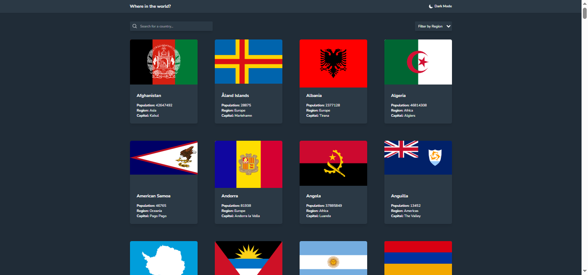

# Frontend Mentor - REST Countries API with color theme switcher solution

This is a solution to the [REST Countries API with color theme switcher challenge on Frontend Mentor](https://www.frontendmentor.io/challenges/rest-countries-api-with-color-theme-switcher-5cacc469fec04111f7b848ca). Frontend Mentor challenges help you improve your coding skills by building realistic projects. 

## Table of contents

- [Overview](#overview)
  - [The challenge](#the-challenge)
  - [Screenshot](#screenshot)
  - [Links](#links)
- [My process](#my-process)
  - [Built with](#built-with)
  - [What I learned](#what-i-learned)

## Overview

### The challenge

Users should be able to:

- See all countries from the data on the homepage
- Search for a country using an `input` field
- Filter countries by region
- Click on a country to see more detailed information on a separate page
- Toggle the color scheme between light and dark mode *(optional)*

### Screenshot

### Links

- [Solution URL ](https://github.com/msalim-dev/rest-countries-frontendmentor-challenge)
- [Live Site URL ](https://musical-cucurucho-99530d.netlify.app/)

## My process

### Built with

- Semantic HTML5 markup
- CSS custom properties
- TailwindCSS
- Flexbox
- CSS Grid
- Mobile-first workflow
- [React](https://reactjs.org/) - JS library
- React Context API

### What I learned

I learned how to use useDeferredValue hook in React for filtering and debouncing key typing and keeping the UI responsiveness.
